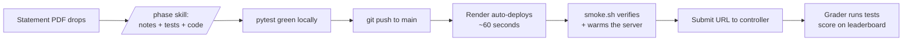

# UBS GCC 2026 — Team Design Doc

*How our competition setup works, end to end. Written 2026-08-22 (competition day). Everything described here is built, deployed, and tested.*

---

## How we operate — read this first

The full flow for every phase, start to finish. Details on each step live in the sections below; this is the order of operations we actually follow on the day.

1. **Statement drops** → save the PDF into `docs/inbox/`
2. **Run `/phase` in Claude Code** → it files the PDF, writes notes + tests, implements the endpoint, gets the whole test suite green, then stops and shows a summary
3. **Review the assumptions** the summary flags — check them against the PDF; this is the human checkpoint where misreadings get caught
4. **Say "push"** → deploy is automatic, live in ~60 s
5. **Verify:** `./scripts/smoke.sh https://ubs-gcc-2026.onrender.com` — all green, and `/health` shows the new commit hash. This also warms the server (free plan sleeps after 15 idle min)
6. **Submit immediately** — paste the URL into the controller, pick the challenge, trigger the run. No long pause between smoke and submit
7. **Passed?** One line in `docs/decisions.md` (usually already written by `/phase`), then wait for the next statement
8. **Failed?** Tell Claude *"phase N failed"* → it pulls the grader's actual requests off the live server (`/debug/requests`, token already in `.env`), shows what they sent vs what we replied, turns the failing request into a test, fixes, and hands back the "push" checkpoint → goto step 4

Rules that must never be broken while doing the above: never delete or change an already-scored endpoint (`pytest` runs all phases, so a red suite = stop), debug locally not via deploys, and no secrets committed — the repo is public.

---

## 1. The competition in one paragraph

UBS releases **one product statement in phases** of increasing complexity during the day, on their "controller" platform. For each phase we: read the statement PDF, implement the required HTTP endpoints, deploy, and submit our server's URL to the controller. The controller fires test requests at our server and scores us on a leaderboard — on **correctness, security, reliability, and product judgment** (they also do Product Owner check-ins, which is why we keep a decision log).

## 2. The big picture

One FastAPI server, one URL, growing all day. Each phase adds endpoints; nothing ever gets removed.



**Live service:** <https://ubs-gcc-2026.onrender.com> · `GET /health` shows which commit is running.

## 3. Repo layout

```
app/
  main.py              one FastAPI app; mounts every phase's router
  reqlog.py            middleware that logs EVERY request/response
  routers/
    phase1.py          POST /square  (practice phase, done)
    debug.py           GET /debug/requests — see what the grader sent us
tests/
  test_smoke.py        health + request-log basics
  test_phase1.py       one test file per phase, statement examples verbatim
docs/
  inbox/               ← drop new statement PDFs here
  phases/phase-N/      statement.pdf + notes.md per phase
  decisions.md         decision log — kept current, it is scored
scripts/
  dev.sh               run locally with hot reload
  smoke.sh <url>       curl-check a running instance
render.yaml            tells Render how to build & run the service
.claude/skills/phase/  the /phase automation (see §4)
CLAUDE.md              rules every Claude session loads automatically
```

## 4. The per-phase loop (the only workflow that matters today)

> **PDF in `docs/inbox/` → run `/phase` in Claude Code → review → say "push" → smoke → submit → log**

The `/phase` skill automates the front half. When you run it, Claude:

1. Files the PDF as `docs/phases/phase-N/statement.pdf` (auto-numbers N)
2. Reads **every page** and fills in `notes.md` — endpoints, request/response shapes, all worked examples copied verbatim, edge cases, and a list of **assumptions** made for anything ambiguous
3. **Writes tests first** from the statement's examples, and confirms they fail before any implementation exists
4. Implements `app/routers/phaseN.py` and mounts it in `main.py`
5. Iterates until the **entire** test suite is green — all phases, not just the new one
6. Adds a line to `decisions.md`, then **stops before pushing** and shows you: the assumptions to double-check against the PDF, the pytest result, and a proposed commit message

Your job at the checkpoint: skim the assumptions against the PDF (that's where wrong guesses hide), then say "push". The human review sits exactly at the point of no return, because push = deploy.

## 5. Testing strategy

- Every worked example in a statement becomes a pytest case asserting the **exact** expected output (including types — the grader may compare JSON exactly, so `25` and `25.0` are different answers).
- Every endpoint also gets bad-input tests: malformed JSON, missing fields, wrong types → expect **422, never a 500**. Security and reliability are scored.
- Old phases' tests are **never deleted**. `pytest` runs everything, so it is structurally impossible to push a change that breaks an already-scored endpoint without noticing.
- Tests use FastAPI's `TestClient` — no server process needed, the whole suite runs in under a second.

## 6. Deployment

**Deploy = `git push` to `main`. That's it.**

Render is connected to the GitHub repo via a Blueprint (`render.yaml` describes the service: Python, Singapore region, health check, auto-deploy). Every push to `main` triggers a rebuild — measured at **~60 seconds** from push to live.

**How to know your code is actually live:** `GET /health` returns the running commit hash. Compare it to `git rev-parse HEAD`. Same hash = the grader will hit exactly the code you tested.

**Free plan policy (team decision):** we stay on Render's free tier. The catch: the service **spins down after ~15 idle minutes** and takes ~50 s to wake. We handle this with a habit, not machinery:

> `smoke.sh` right before submitting doubles as the warm-up. Smoke, then submit **immediately** — no long pause in between.

## 7. Debugging

| Situation | Do this |
|---|---|
| Developing / something's broken | `scripts/dev.sh` + `pytest` **locally**. Never debug via deploys — each round-trip costs ~2 min. |
| A grader test case fails and you can't see why | Tell Claude "phase N failed" — the `DEBUG_TOKEN` is in the local `.env` (gitignored), so Claude pulls `GET /debug/requests?token=…&only_errors=true` from the live server, saves the evidence to `docs/phases/phase-N/`, and shows exactly what the grader sent and what we replied. (Manual fallback: token is in Render dashboard → service → Environment.) This flow is tested and working. |
| A check fails right after a deploy goes live | Retry once before panicking — we observed a one-off 404 seconds after cutover that vanished on retry. |
| Not sure which code is live | `GET /health`, compare commit hash. |

Every request to the live server is also logged as JSON to stdout (visible in Render's log tab) by `app/reqlog.py`.

## 8. The controller (what we know, what to check at first login)

- You provide your server's link and pick a challenge; the platform runs the tests on the spot. We control *when* evaluation happens.
- **Check on first login:** does the link field want the **base URL** (`https://ubs-gcc-2026.onrender.com`) or a **full endpoint URL** (`…/square`)? Pasting the wrong flavor wastes a submission.
- **Check:** does the leaderboard keep the **best** or the **latest** score per challenge? If latest, don't re-run an old challenge unless you're sure it still passes.
- Record both answers in `LINKS.md` / the phase's `notes.md` as soon as you know.

## 9. Backup plan: if a statement ever forces one server per challenge

Default is **one server, many endpoints** — challenges are separated by *path* (`/square`, `/cube`), and we submit the same URL for every challenge. Do not split preemptively.

If a statement demands separate servers, the split is cheap because of how the code is structured:

- **Same repo, same code, same single `main.py`.** We add more service entries to `render.yaml` — each entry is a separate container on Render with its own URL.
- Each container gets a `ROLE` env var (set per-service in `render.yaml`). `main.py` reads it at boot and mounts **only** that server's routes — so the "cube server" answers `/cube` and returns 404 for everything else. Outside observers can't tell it shares code with the square server; the isolation is real at the HTTP level.
- Locally and in tests, `ROLE` is unset → defaults to `all` → one process serves everything, so the test suite doesn't change.
- **One `git push` still deploys the whole fleet in parallel**, all on the same commit (verify: every server's `/health` shows the same hash).
- Submission changes to: paste **each server's own URL** for its challenge.

Estimated time to activate: ~5 minutes. Servers calling each other, if ever required, is just outbound `httpx` calls inside a router — not a deployment change.

One gotcha: `generateValue: true` gives each server its **own** `DEBUG_TOKEN`. If we split, move `DEBUG_TOKEN` into a shared Render env group so one token works on every server.

## 10. Iron rules (short version)

1. **Never break an earlier phase's endpoint.** `pytest` before every push.
2. **Deploy = push.** Verify with `smoke.sh` + the `/health` hash.
3. **Debug locally**, not on Render.
4. Follow the per-phase loop (§4) every time.
5. **No secrets in the repo** — it's public. Secrets live in Render's Environment tab.
6. Commit messages: plain description of the change.

## 11. Day-of checklist

- [ ] Log into the controller; answer the two open questions in §8; fill `LINKS.md`
- [x] `DEBUG_TOKEN` is already in the local `.env` — done and verified against the live server
- [ ] `./scripts/smoke.sh https://ubs-gcc-2026.onrender.com` — confirm all green before phase 1 drops
- [ ] Per phase: inbox → `/phase` → review assumptions → "push" → smoke → **submit immediately** → decisions.md
- [ ] If anything looks weird on the grader side: `/debug/requests` first
